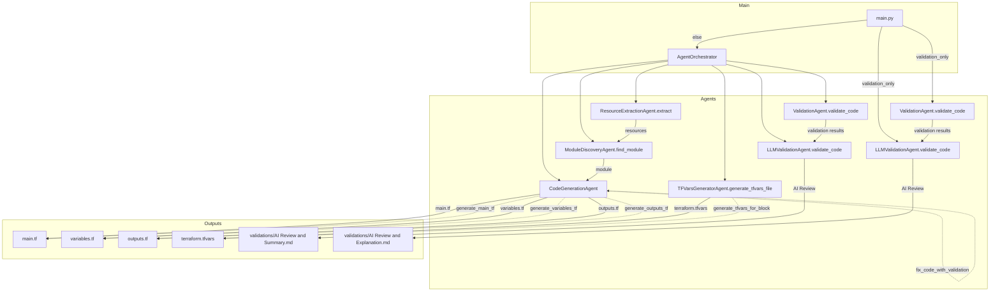

## Codebase Flow Diagram

Below is a detailed Mermaid diagram showing the flow of the codebase, the main agents, and their key functions:

**Legend:**
- **main.py**: Entry point, parses arguments and runs either validation or full pipeline.
- **AgentOrchestrator**: Coordinates the pipeline, calling each agent in sequence.
- **ResourceExtractionAgent**: Extracts resource names from `resources.md`.
- **ModuleDiscoveryAgent**: Maps resource names to Terraform modules.
- **CodeGenerationAgent**: Generates `main.tf`, `variables.tf`, and `outputs.tf`.
- **TFVarsGeneratorAgent**: Generates `terraform.tfvars` from variables.
- **ValidationAgent**: Runs tflint, tfsec, terraform fmt, and validate.
- **LLMValidationAgent**: Uses LLM to review and explain validation results.
- **Outputs**: Generated files and validation reports.